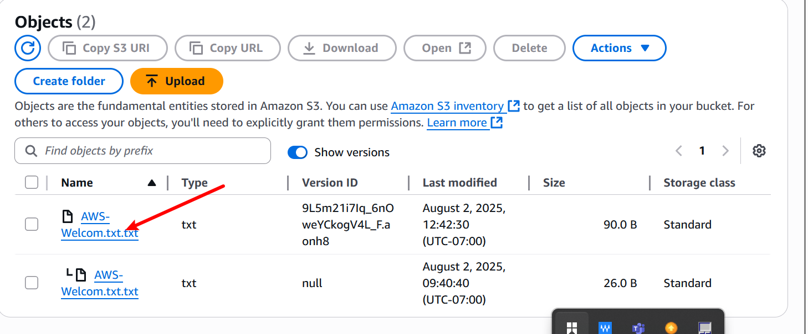

# AWS_S3

# What is amazon S3 ?
Amazon S3 (Simple Storage Service) is a cloud-based object storage service offered by AWS that allows users to store, retrieve, and manage any amount of data at any time, from anywhere on the web.

# Benefits of S3
- Scalable : store unlimited data
- Durable : 99.999999% durability
- Highly available : 99.99% uptime
- secure : fine-grained access control and encryption
- cost-effective : pay for only what you use etc.

# Common s3 Use Case.
- Backup and disaster recovery
- Data archiving
- Media Hosting
- Big data analytic storage
- static website for hosting (HTML/CSS/JS files)

# S3 Core Concept
- Bucket : A container for storing objects. Each bucket must have a unique name.
- object : The actual file/data stored in S3 (e.g., image, video, document).
- Key : The unique identifier for an object within a bucket (like a file path).
- Storage class : Determines cost, availability, and retrieval time (e.g., Standard, Glacier).
- Access Control : Defines who can access the bucket or object (via IAM, ACLs, or policies).
- Durability :S3 is designed for 11 9’s durability (data redundancy across multiple zones).
- Availability : High uptime ensures you can access your data when needed.
- Data Transfer : You can upload/download data using Console, SDKs, AWS CLI, or APIs.
- versioning : Tracks all versions of an object, enabling recovery from overwrites/deletes.

# What is S3 Versioning ?
S3 versioning is a feature that allows you to keep multiple variants of an object in the same bucket.Imagine you're working on a big project and you accidentally delete an important file. But wait, with S3 versioning, it's like having a magic undo button.

Here's how it works: Normally, when you delete a file in S3, it's gone for good. But with versioning turned on, S3 keeps a copy of every version of your file, even if you delete it or overwrite it. So if you make a mistake, you can easily go back to a previous version and restore it, just like rewinding time.

# The practical phase by Setting up The Creation of An Amazon S3 Bucket. 
1. First, Navigate to the search bar on the AWS Console .
a. Search for S3

.

2. From there, locate and click on the "Create bucket" Button .

.

3. proceed with creating new bucket.
a. provide a unique name for the bucket
b. select ACL Disabled for object ownership
c. Ensure to check the "block all public access" option 
d. Leave buckrt versioning disabled
e. proceed with the defaults settings
f. once done , click on "create bucket" button.
 .

.

.

.

If you encounter a problem when creating the bucket, consider changing the name and then proceeding the name again.
.
.

Bucket has been successfully created.
.

# Now Lets upload an Object into the Bucket Named "My-first-s3-demo-bucket-080.

1. let's create a file on your laptop with some data . we will write welcome to to the aws world and save it.
.

2. Next click on the upload button.
.

3. click on Add file and select the file you created 
.

4. once selected , you will then see the file being added. 

a. click upload to complete the process .
.

.

# The Next step is Enabling Versioning.
1. In the bucket properties section on the right side, you will notice that bucket versioning is currently disable 
.

So now we will enable it.

2. click on edit 
.

3. select enable and click on save changes.
.

4. Now, if you modified the content of the file and upload it again , you will create a new version of the file .
.

a. By clicking on show version , you will be able to see all the version of the file you have uploaded.
.

b, Now , whenever you make changes to the file and upload it again to the same file bucket, it will contenue creating version of that file for future reference.

# How To view The Content Of Both Version ?
1. In the permission section of the bucket, ypu will notice that "Block all public Access" is enable .
a. click on Edit to make changes.
.

2. Now, uncheck the block all public access and 
click on save changes .
.

a. Type confirm and on confirm 
.

By taking this action you are allowing your file to be publically accessible. 
.

3. Now, you need to create a bucket policy to specify the action you want the public to be abe to perform on your file. Click on Edit.
.

4. Click on the policy Generator
.

5. Now select the type of policy as s3 bucket policy.

a. set the effect to "Allow"
b. specify the principal as "*" which means all users.
.

c. choose the action "Get object and Get object version" 
d. In the field of Amazon Resource name (ARN) Type ARN of your bucket and add this "/*"

e. click on add statement.
.

6. click on generate policy and copy the bucket policy documents appear and close.
.

a. Navigate to the bucket policy and paste the policy you created using the policy generator and click on save changes.
.

7. click on the version of your file 

8. click on the object URL
.

You will see the content of the file you created.
.

If we click on the latest version and click on the object URL. you will get the latest data.
.

.

.

# Creating Lifecycle policies
1. Navigate to the management section of the bucket .
a. click and add lifecycle rule.
.

2. Give the specification and click to create 
.

.

.

